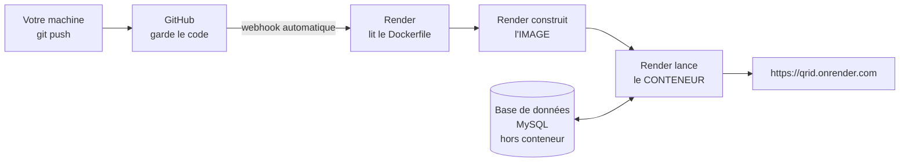
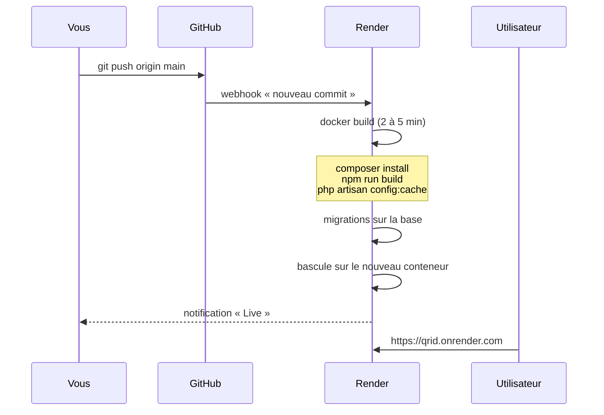
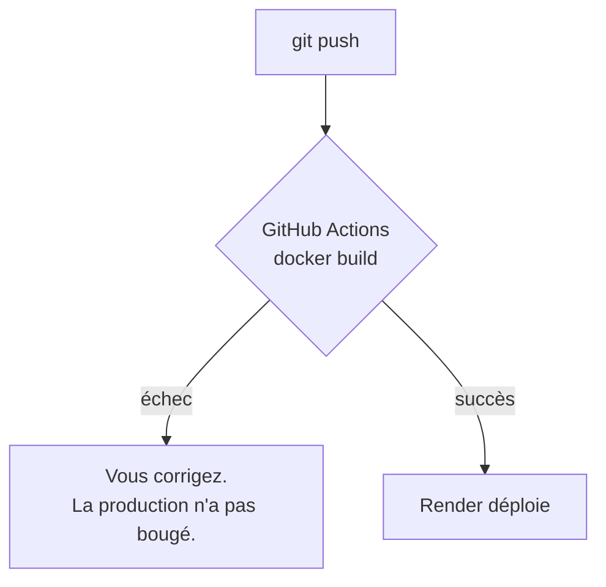
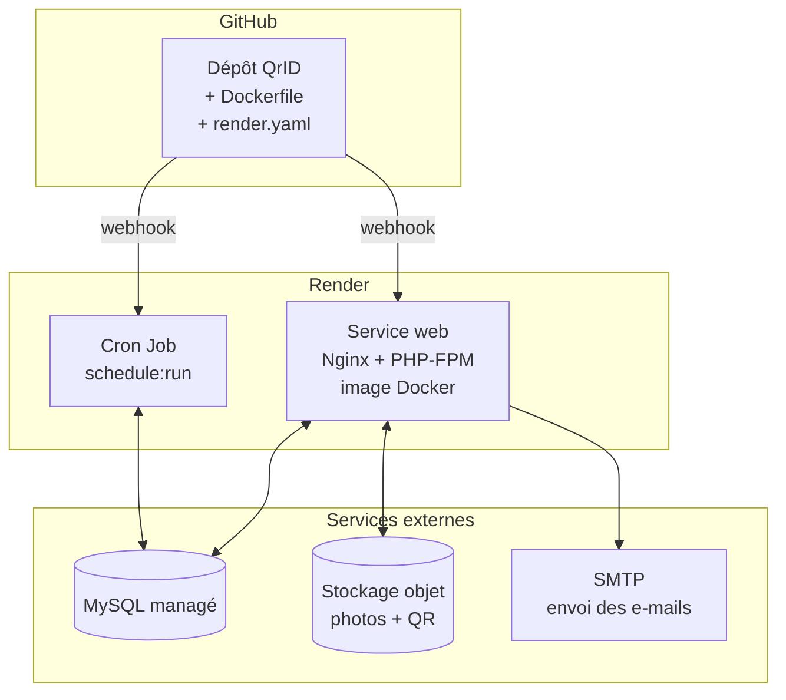

# Déploiement de QrID — Docker, GitHub, Render et Neon

> Document d'architecture et plan de mise en production.
> Rédigé le 6 août 2026, à partir de l'état réel du dépôt.

---

## Décisions arrêtées

| Sujet | Décision | Date |
|---|---|---|
| **Base de données** | **MySQL managé.** Aucun portage PostgreSQL. | 6 août 2026 |
| **Neon / PostgreSQL** | **Reporté** à un futur projet. Le chapitre 4 bis reste comme référence. | 6 août 2026 |
| Docker en local | **Non installé.** Render construit, GitHub Actions valide. | 6 août 2026 |

**Ce que la décision « MySQL » évite** — les quatre chantiers du chapitre 4 bis
ne sont plus au programme :

- 25 agrégations à réécrire ;
- 17 `LIKE` qui seraient devenus sensibles à la casse, **sans lever d'erreur** ;
- trois dialectes de fonctions de date à maintenir ;
- une suite de tests à faire tourner sur PostgreSQL pour qu'elle prouve
  encore quelque chose.

Le déploiement ne touche donc **aucune ligne de code applicatif**. C'est ce
qui le rend sûr : si un écran casse en production, la faute est dans
l'infrastructure, jamais dans une requête réécrite à la hâte.

---

## « Si on n'installe pas Docker, à quoi sert Docker ? »

La question est légitime, et la réponse tient à une distinction : **« Docker »
désigne trois choses différentes.**

| | Ce que c'est | En avons-nous besoin ? |
|---|---|---|
| **Le format** | la syntaxe du `Dockerfile`, le format d'image | **oui** — c'est ce qu'on écrit |
| **Le moteur** | le programme qui lit la recette et fabrique l'image | **oui**, mais **chez Render** |
| **Docker Desktop** | une application Windows qui embarque le moteur | **non** |

On ne supprime donc pas Docker : on supprime **notre copie du moteur**.
Quelqu'un exécute bien Docker — les serveurs de Render.

### Le mécanisme est déjà présent dans ce projet

| Fichier | Qui l'écrit | Qui le lit | Où tourne le programme |
|---|---|---|---|
| `composer.json` | un humain | Composer | **chez Render** |
| `package.json` | un humain | npm / Vite | **chez Render** |
| `Dockerfile` | un humain | moteur Docker | **chez Render** |

Personne n'exécute `composer install` pour la production, et pourtant
`vendor/` existe en ligne. Le `Dockerfile` suit exactement la même logique.

> Le fichier s'appelle littéralement `Dockerfile`. **Aucune extension** — ni
> `.docker`, ni `.dockerfile`. C'est du texte brut. L'extension VS Code pour
> Docker ne sert qu'à colorer la syntaxe : elle n'exécute rien, ne génère rien,
> et reste facultative.

### La raison décisive : PHP n'a pas de moteur natif sur Render

Render démarre nativement du Node, du Python, du Ruby, du Go. **PHP ne figure
pas dans cette liste.**

Pour une application Laravel, Docker n'est donc pas une option parmi d'autres :
**c'est le seul chemin.** Sans `Dockerfile`, Render regarde le dépôt, y voit du
PHP, et n'a aucun moyen de l'exécuter.

> À vérifier sur la documentation de Render avant de vous engager : les
> environnements natifs qu'ils proposent évoluent.

### Ce que le Dockerfile remplace, ici précisément

Pour faire tourner QrID en développement, il a fallu :

1. installer XAMPP — Apache, PHP, MySQL ;
2. ouvrir `C:\xampp\php\php.ini` et décommenter `extension=gd` ;
3. installer Composer, puis `composer install` ;
4. installer Node, puis `npm install && npm run build`.

**Aucune de ces quatre étapes n'est écrite dans le dépôt.** Elles vivent dans
une mémoire et dans une machine. Le `Dockerfile` en est le procès-verbal : une
quinzaine de lignes, versionnées, que Render rejoue à l'identique à chaque
déploiement.

### Ce qui ne change pas

Votre poste de développement continue exactement comme aujourd'hui : XAMPP,
`php artisan serve`, `npm run dev`. Le `Dockerfile` ne s'adresse qu'à Render.
Il n'y a rien à changer dans vos habitudes.

---

## Qui écrit quoi — la confusion la plus fréquente

> « Docker, on l'utilise en local, c'est lui qui génère le Dockerfile. »

**Non.** Le `Dockerfile` n'est généré par rien du tout : c'est un fichier texte
**écrit à la main**, versionné comme `composer.json` ou `routes/web.php`.
Docker ne l'écrit pas, il le *lit*. C'est une recette — on la rédige.

Et dans cette configuration, **Docker ne tourne jamais sur votre machine**.

| Étape | Qui la fait | Où |
|---|---|---|
| Écrire le `Dockerfile` | un humain | dans l'éditeur |
| Versionner | `git push` | GitHub |
| **Lire le Dockerfile** | **Render** | serveurs Render |
| **Construire l'image** | **Render** | serveurs Render |
| **Lancer le conteneur** | **Render** | serveurs Render |
| Servir l'URL publique | Render | Internet |

Votre machine ne fait que **pousser du texte**. C'est la raison pour laquelle
la contrainte « pas de Docker Desktop » ne pose aucun problème.

---

## 0. Trois idées reçues à écarter d'abord

Avant tout le reste, parce qu'elles changent la nature des décisions à prendre.

### « Docker ou Render nécessitent PostgreSQL »

**Non.** Ni l'un ni l'autre.

- **Docker** ne connaît aucune base de données. Il empaquette votre
  application ; ce à quoi elle se connecte ne le regarde pas.
- **Render** *propose* du PostgreSQL managé, comme il propose du Redis. Ce
  n'est pas une exigence : un service Render se connecte à n'importe quelle
  base joignable sur Internet — MySQL compris, chez n'importe quel hébergeur.

Vous pouvez déployer QrID sur Render, en Docker, avec une base **MySQL**, sans
changer une ligne de code. C'est même la voie la plus rapide.

### « Le README se trompe en parlant de SQLite »

**Il a raison.** Trois moteurs cohabitent, et chacun a sa place :

| Moteur | Où | Pourquoi |
|---|---|---|
| **SQLite** en mémoire | tests uniquement (`phpunit.xml`) | 289 tests en 90 secondes, aucune base à installer |
| **MySQL** | développement et production actuelle | le moteur de référence du projet |
| **PostgreSQL** | *envisagé*, via Neon | voir le chapitre 4 bis |

La phrase du README — « les tests tournent sur SQLite en mémoire » — décrit
exactement `phpunit.xml` ligne 30. Rien à corriger.

### « Passer à PostgreSQL est une contrainte »

C'est un **choix**, et il est parfaitement défendable — vous m'avez dit vouloir
découvrir Neon et PostgreSQL. Mais alors il faut le prendre pour ce qu'il est :
un chantier de portage, avec un coût mesuré au chapitre 4 bis, et non une case
à cocher.

---

## 1. Pourquoi Docker, pour **ce** projet précisément

La réponse générale — « ça marche pareil partout » — n'apprend rien. Voici
la réponse qui vient de ce dépôt.

### L'incident de l'extension `gd`

Pendant le développement, la génération des QR Codes en PNG et le
redimensionnement des photos de profil échouaient. La cause : l'extension PHP
`gd` n'était pas activée. Il a fallu ouvrir `C:\xampp\php\php.ini`, décommenter
une ligne, redémarrer, et espérer ne pas l'oublier ailleurs.

**Cette ligne n'existe nulle part dans le dépôt.** Elle vit dans un fichier de
configuration sur une machine. Un serveur neuf, un collègue, une nouvelle
machine : l'erreur revient, et elle revient sous une forme sournoise — le
redimensionnement des photos ne plantait pas, il se dégradait silencieusement.

Avec Docker, cette ligne devient :

```dockerfile
RUN docker-php-ext-install gd
```

Elle est **dans le dépôt**, versionnée, relue en revue de code, et rejouée à
l'identique à chaque construction. C'est tout Docker en une phrase : *la
configuration du serveur devient du code du projet*.

### Ce que le projet exige réellement

Relevé dans `composer.json`, `package.json` et le code :

| Besoin | Origine | Sans Docker |
|---|---|---|
| PHP ≥ 8.2 | `composer.json` | dépend de l'hébergeur |
| extension `gd` | photos + QR PNG | ligne dans un `php.ini` |
| extension `pdo_mysql` | base de données | paquet système |
| Node ≥ 20 + npm | `vite build` | installé à la main |
| Composer | dépendances PHP | installé à la main |
| serveur web + PHP-FPM | servir l'application | configuration Apache/Nginx |

Sept éléments à aligner. Une seule erreur sur les sept, et l'application soit
ne démarre pas, soit se dégrade sans le dire — comme `gd`.

### Ce que Docker ne résout **pas**

Autant le dire tout de suite, pour éviter la déception :

- **il ne rend pas l'application plus rapide** ; il la rend *reproductible* ;
- **il ne remplace pas une base de données** : les données vivent en dehors ;
- **il ne sauvegarde rien** : un conteneur détruit emporte tout ce qu'il
  contenait — c'est justement le problème n° 2 de la section 4 ;
- **il n'évite pas les erreurs de configuration**, il les déplace du serveur
  vers un fichier que l'on peut relire.

---

## 2. La chaîne GitHub → Render → Docker

Les trois outils ne font pas la même chose. La confusion la plus courante est
de croire que Docker « héberge ». Il n'héberge rien.



### Les trois mots à ne pas confondre

| Mot | Ce que c'est | Analogie |
|---|---|---|
| **Dockerfile** | une recette écrite | la fiche de cuisine |
| **Image** | le résultat figé de la recette | le plat sous vide, prêt |
| **Conteneur** | une image en train de tourner | le plat servi et chaud |

Le `Dockerfile` est **dans votre dépôt**. L'image est **construite par Render**.
Le conteneur **tourne chez Render**.

### Le rôle exact de chacun

**GitHub** garde le code et déclenche. C'est la source de vérité. Rien ne part
en production qui ne soit pas sur `main`.

**Render** est l'hébergeur. Il fait trois choses : il écoute GitHub, il
construit l'image à partir du `Dockerfile`, il fait tourner le conteneur et lui
donne une URL publique en HTTPS.

**Docker** est le format. Ni GitHub ni Render ne « contiennent » Docker : ils
manipulent un format que Docker a défini.

### Le cycle complet, du clavier à la production



Vous ne tapez **aucune commande de déploiement**. `git push` suffit. C'est le
principal apport de cette chaîne : le déploiement cesse d'être un geste manuel
que l'on rate un vendredi soir.

---

## 3. Travailler sans Docker Desktop

Vous avez posé la contrainte : pas d'installation locale. **C'est jouable**, et
c'est même une configuration courante. Render construit l'image sur ses
serveurs ; votre machine n'a jamais besoin de Docker.

### Ce que vous perdez

Vous ne pouvez pas essayer l'image avant de la pousser. Concrètement : une
erreur dans le `Dockerfile` ne se voit qu'après un `git push`, et après deux à
cinq minutes de construction chez Render. Les premières mises au point sont
donc lentes — comptez cinq à dix allers-retours pour un premier `Dockerfile`.

### Le filet : GitHub Actions

GitHub sait construire une image Docker gratuitement sur chaque `push`. On lui
demande de construire **sans déployer** : si la construction échoue, vous le
savez en deux minutes, dans l'onglet *Actions*, sans avoir touché à la
production.



C'est le remplaçant honnête de Docker Desktop dans votre cas : pas de
prévisualisation, mais une alerte avant la production.

---

## 4. Les quatre obstacles réels de ce projet

Ce ne sont pas des généralités. Chacun a été vérifié dans le code.

### Obstacle 1 — La base de données. **Le plus important.**

Render propose PostgreSQL en base managée. Le projet, lui, tourne sur MySQL, et
**pas seulement par configuration** : le code contient de la syntaxe que
PostgreSQL refuse.

Relevé exact : **25 occurrences dans 7 fichiers**.

```php
// Fonctionne sur MySQL et SQLite. ÉCHOUE sur PostgreSQL :
// « operator does not exist: character varying = integer »
->selectRaw('SUM(status = ?) as reussis', [Payment::STATUS_SUCCESS])
->selectRaw('SUM(is_active = 1) as actifs')
```

PostgreSQL n'additionne pas des booléens. Il faudrait réécrire chacune de ces
lignes :

```php
->selectRaw('COUNT(*) FILTER (WHERE status = ?) as reussis', [...])
```

S'ajoutent `DATE_FORMAT` dans `AdminStatsService` (déjà traité pour SQLite,
pas pour PostgreSQL) et les colonnes `enum()` de trois migrations.

**Trois voies possibles :**

| Voie | Coût en code | Coût financier | Remarque |
|---|---|---|---|
| **A.** MySQL externe managé | **aucun** | gratuit à ~10 $/mois | Aiven, Clever Cloud, Railway |
| **B.** PostgreSQL Render | 25 requêtes à porter + tests | offre gratuite limitée dans le temps | tout reste chez Render |
| **C.** MySQL en conteneur Render | faible | disque persistant payant | vous gérez les sauvegardes |

**Ma recommandation : la voie A pour la première mise en ligne.** Elle ne
touche pas une ligne de code, donc elle ne peut rien casser.

Si vous préférez la voie B — et Neon est une très bonne raison de la préférer —
le chapitre suivant en donne le coût exact et le chemin complet.

---

## 4 bis. Neon et PostgreSQL — REPORTÉ

> **Décision du 6 août 2026 : ce chapitre ne s'applique pas à QrID.**
> Le projet reste sur MySQL. Neon sera essayé sur un projet neuf, où le
> portage ne coûte rien puisqu'il n'y a rien à porter.
>
> Le chapitre est conservé en l'état : il chiffre ce qu'un portage coûterait,
> et cette mesure vaudra encore le jour où la question se reposera.

Voici ce que cela impliquerait, sans rien arrondir.

### Ce que Neon apporte

| | Supabase (votre usage actuel) | Neon |
|---|---|---|
| Projets sur l'offre gratuite | 2 | beaucoup plus |
| Moteur | PostgreSQL | PostgreSQL |
| Particularité | suite complète (auth, stockage, API) | base seule, **branches de base** |
| Mise en veille | oui | oui, réveil rapide |

La fonctionnalité qui distingue Neon : les **branches de base de données**. On
crée une copie instantanée de la base — schéma *et* données — pour essayer une
migration, puis on la jette. Sur un projet où l'on ajoute des colonnes
régulièrement (`deactivated_at`, `is_default` récemment), c'est un vrai
confort : on essaie la migration sur une branche, pas sur la production.

> Les quotas et l'offre gratuite de Neon évoluent. Vérifiez leur page de
> tarification : je décris un fonctionnement, pas un contrat.

### Le coût réel du portage — quatre chantiers

#### Chantier 1 — Les 25 agrégations conditionnelles

**Le problème.** PostgreSQL n'additionne pas des booléens :

```php
->selectRaw('SUM(status = ?) as reussis', [Payment::STATUS_SUCCESS])
// PostgreSQL : « function sum(boolean) does not exist »
```

**La solution, et elle est meilleure que prévu.** La forme normalisée `CASE
WHEN` fonctionne sur **les trois moteurs** :

```php
->selectRaw('SUM(CASE WHEN status = ? THEN 1 ELSE 0 END) as reussis', [...])
```

Vérifié en base sur les données de démonstration : les deux formes rendent
**exactement le même résultat**.

```
SUM(status = ?)                             -> 50
SUM(CASE WHEN status = ? THEN 1 ELSE 0 END) -> 50
```

**Pourquoi `CASE WHEN` plutôt que `COUNT(*) FILTER (WHERE …)`** — la forme
`FILTER` est plus élégante et fonctionne sur PostgreSQL *et* SQLite, mais
**pas sur MySQL**. En la choisissant, on ferme la porte au retour en arrière.
`CASE WHEN` marche partout : le projet reste libre de changer de moteur.

Le portage est mécanique : 25 remplacements dans 7 fichiers, aucune logique
à repenser.

#### Chantier 2 — La recherche deviendrait silencieusement inexacte

**C'est le piège le plus sérieux, et il ne provoque aucune erreur.**

Les filtres de recherche utilisent `LIKE`, **17 fois dans 5 fichiers**. Or :

- MySQL, avec sa collation par défaut, est **insensible à la casse** ;
- PostgreSQL est **sensible à la casse**.

Mesuré sur la base réelle :

```
'%Diop%' -> 4 résultats
'%diop%' -> 4 résultats     (MySQL : insensible)
```

Sur PostgreSQL, `'%diop%'` rendrait **0 résultat**. Personne ne tape « Diop »
avec une majuscule dans un champ de recherche. Les six écrans de liste
paraîtraient fonctionner et ne trouveraient plus rien.

**La correction** : `ILIKE` sur PostgreSQL, `LIKE` ailleurs. Comme le moteur
change, cela demande un point unique de décision — sur le modèle de
`FiltrePeriode`, une petite classe qui rend le bon opérateur.

```php
// Esquisse — à un seul endroit, jamais dispersé dans les contrôleurs
public static function operateurLike(): string
{
    return DB::connection()->getDriverName() === 'pgsql' ? 'ilike' : 'like';
}
```

#### Chantier 3 — Les fonctions de date

`AdminStatsService` gère déjà deux dialectes. Il en faudra un troisième :

| | Par jour | Par mois |
|---|---|---|
| MySQL | `DATE(created_at)` | `DATE_FORMAT(created_at,'%Y-%m')` |
| SQLite | `DATE(created_at)` | `strftime('%Y-%m', created_at)` |
| **PostgreSQL** | `CAST(created_at AS DATE)` | `to_char(created_at,'YYYY-MM')` |

Attention : `DATE(x)` **n'existe pas** en PostgreSQL. Le code actuel l'emploie
pour le regroupement journalier dans trois écrans.

#### Chantier 4 — Les tests ne prouveraient plus rien

**Le point que je veux souligner le plus fort.**

Les 289 tests tournent sur SQLite. Or SQLite **accepte** `SUM(status = ?)` et
**ignore** la casse comme MySQL. Autrement dit : après le portage, la suite
resterait entièrement verte **tout en ne testant pas le moteur de production**.

Une suite verte qui ne prouve rien est pire qu'une suite absente : elle
rassure.

Deux issues :

- **faire tourner les tests sur PostgreSQL** — un service PostgreSQL dans
  GitHub Actions, `phpunit.xml` modifié. Les tests ralentissent (plus de base
  en mémoire), mais ils redeviennent une preuve ;
- **garder SQLite et accepter** que les écarts de dialecte ne soient
  découverts qu'en production. À déconseiller : c'est exactement ainsi que
  l'écran Statistiques est tombé en 500 sur une portée non qualifiée.

### Récapitulatif du chantier

| Chantier | Ampleur | Risque si oublié |
|---|---|---|
| 25 agrégations `CASE WHEN` | mécanique, 7 fichiers | erreur SQL **visible** |
| 17 `LIKE` → `ILIKE` | 5 fichiers + une classe | **recherche muette, aucune erreur** |
| Fonctions de date | 1 fichier, 3 emplacements | erreur SQL **visible** |
| Tests sur PostgreSQL | CI + `phpunit.xml` | **suite verte qui ne prouve rien** |

Les deux lignes en gras sont les dangereuses : elles ne lèvent aucune
exception.

### Deux points propres à Neon

**La mise en veille.** Neon suspend une base inactive. La première requête la
réveille. Combinée à la mise en veille de Render (obstacle 4), cela peut
donner un premier chargement très lent. Les deux réveils s'additionnent.

**Le mode « pooled ».** Neon expose deux chaînes de connexion : directe et
*pooled*. Une application web utilise la **pooled** ; la directe est réservée
aux migrations. Se tromper donne des erreurs de connexions épuisées sous
charge — et seulement sous charge, donc jamais en test.

Il faut aussi `sslmode=require` : Neon refuse les connexions en clair.

### Recommandation

Deux objectifs différents, deux réponses différentes :

**Pour mettre QrID en ligne rapidement** → MySQL managé. Zéro ligne de code,
zéro risque de régression silencieuse.

**Pour apprendre PostgreSQL et Neon** → faites-le, mais **comme un chantier
identifié**, pas glissé dans le déploiement. Dans cet ordre :

1. porter les 25 agrégations en `CASE WHEN` → *le projet reste sur MySQL, rien
   ne casse, et il devient portable* ;
2. faire tourner les tests sur PostgreSQL en CI ;
3. corriger ce que ces tests révèlent — `LIKE`, dates, et ce qu'on n'a pas
   prévu ;
4. **alors seulement** basculer la connexion vers Neon.

L'étape 1 a une vertu propre : elle est utile **même si vous restez sur
MySQL**. Elle ne vous engage à rien.

Mêler portage et déploiement, en revanche, garantit qu'au premier écran cassé
vous ne saurez pas si la faute vient de Docker, de Render ou de PostgreSQL.

---

### Obstacle 2 — Le système de fichiers disparaît à chaque déploiement

Un conteneur est **jetable**. À chaque `git push`, Render en construit un neuf
et détruit l'ancien. Tout ce qui avait été écrit sur son disque est perdu.

Or le projet écrit sur le disque :

| Contenu | Chemin | Perte acceptable ? |
|---|---|---|
| **Photos de profil** | `storage/app/public/photos/` | **NON — données de client** |
| Cache des QR Codes | `storage/app/public/qr/` | oui, régénérable |
| Journaux | `storage/logs/` | oui, à externaliser |

Les photos sont le vrai problème : un client téléverse sa photo, vous déployez
un correctif le lendemain, **sa photo a disparu**. Sans que rien ne le signale.

**Deux voies :**

- **Disque persistant Render** — une case à cocher, payant, simple ;
- **Stockage objet** (Cloudflare R2, Amazon S3, Backblaze B2) — le disque du
  conteneur ne sert plus à rien, les fichiers vivent ailleurs. Laravel gère
  cela nativement : on change `FILESYSTEM_DISK`, le code ne bouge pas puisqu'il
  passe déjà par `Storage::disk()`.

**Recommandation : le stockage objet.** C'est la seule solution qui survit à
un changement d'hébergeur, et Cloudflare R2 ne facture pas la sortie de
données — ce qui compte pour des photos consultées à chaque scan de carte.

### Obstacle 3 — La file d'attente et le planificateur ne tournent pas tout seuls

`routes/console.php` déclare :

```php
Schedule::command('registrations:purge')->dailyAt('03:00');
Schedule::command('queue:monitor database:mail --max=50')->everyMinute();
```

Et `.env.example` pose `QUEUE_CONNECTION=database`.

Un service web Render ne fait que **répondre aux requêtes HTTP**. Il n'exécute
ni `queue:work` ni `schedule:run`. Sans intervention :

- les e-mails de confirmation d'inscription **restent en file, jamais envoyés** ;
- les inscriptions expirées ne sont jamais purgées.

Le premier point est bloquant : **personne ne peut créer de compte.**

**Trois voies :**

| Voie | Comment | Remarque |
|---|---|---|
| **Worker Render** | second service, même image, commande `queue:work` | propre, payant |
| **Cron Job Render** | `schedule:run` toutes les minutes | couvre aussi le planificateur |
| **Envoi synchrone** | `QUEUE_CONNECTION=sync` | l'inscription attend l'envoi du mail |

Pour démarrer, `sync` est acceptable : l'inscription prendra une seconde de
plus. Dès qu'il y a du volume, il faut un worker.

### Obstacle 4 — Le plan gratuit s'endort

L'offre gratuite de Render suspend un service après une quinzaine de minutes
sans trafic. La requête suivante le réveille : **30 à 60 secondes d'attente**.

Pour une carte de visite numérique, c'est un problème de fond. Quelqu'un scanne
votre QR Code en réunion et regarde un écran blanc pendant quarante secondes.
Le premier scan est exactement celui qu'il ne faut pas rater.

Le plan gratuit convient donc pour **valider le déploiement**, pas pour la mise
en service réelle.

> ⚠️ Les offres, quotas et tarifs de Render changent régulièrement. Les
> éléments ci-dessus décrivent la situation telle que je la connais ; vérifiez
> la page de tarification avant d'engager quoi que ce soit.

---

## 5. Architecture cible



**Le principe à retenir : le conteneur ne garde rien.** Base de données,
fichiers et e-mails vivent en dehors. On peut le détruire et le reconstruire à
tout moment sans perte — c'est ce qui rend le déploiement sans risque.

---

## 6. Les fichiers à créer

Aucun n'existe encore dans le dépôt.

**Écrits le 9 août 2026.** Sept fichiers, et non six : le plan initial en
prévoyait cinq, deux se sont imposés à l'écriture.

| Fichier | Rôle |
|---|---|
| `Dockerfile` | la recette, en trois étapes : assets, dépendances PHP, image finale |
| `.dockerignore` | exclut `vendor/`, `node_modules/`, `.env` et **`public/hot`** |
| `docker/nginx.conf` | gabarit : racine sur `public/`, port injecté au démarrage |
| `docker/php.ini` | *(ajouté)* erreurs masquées, OPcache, limites de téléversement |
| `docker/supervisord.conf` | *(ajouté)* surveille nginx **et** php-fpm |
| `docker/entrypoint.sh` | vérifications, migrations, caches, `storage:link` |
| `render.yaml` | décrit les services — évite la configuration à la souris |
| `.github/workflows/ci.yml` | tests + construction de l'image à chaque `push` |

**Pourquoi `supervisord.conf`** — un conteneur ne fait tourner qu'un processus,
or il en faut deux : nginx et php-fpm. On lit souvent la solution « php-fpm en
arrière-plan, nginx au premier plan ». Elle a un défaut sérieux : si php-fpm
meurt, le conteneur reste vivant et répond 502 à tout le monde. Render, lui,
voit un conteneur en bonne santé et ne redémarre rien. Supervisor surveille les
deux et arrête tout si l'un ne repart pas.

**Pourquoi `php.ini`** — l'image officielle n'en fournit aucun. Sans lui, PHP
tourne avec ses valeurs de repli : `display_errors` actif — donc les chemins du
serveur et le mot de passe de la base affichés dans la page à la première
erreur — et OPcache désactivé.

### Pourquoi un `Dockerfile` en deux étapes

```dockerfile
# Étape 1 — construction des assets. Node n'existe QUE ici.
FROM node:22-alpine AS assets
...
RUN npm run build

# Étape 2 — l'image finale. Elle récupère le résultat, pas l'outillage.
FROM php:8.3-fpm-alpine
COPY --from=assets /app/public/build ./public/build
```

Node, npm et `node_modules` pèsent plusieurs centaines de mégaoctets et ne
servent **qu'à la construction**. En deux étapes, ils n'entrent jamais dans
l'image finale : elle démarre plus vite, et sa surface d'attaque est plus
petite.

---

## 7. Variables d'environnement

À saisir dans Render, **jamais dans le dépôt**.

| Variable | Valeur | Note |
|---|---|---|
| `APP_KEY` | `base64:…` | `php artisan key:generate --show` |
| `APP_ENV` | `production` | |
| `APP_DEBUG` | `false` | **impératif** : `true` expose la configuration |
| `APP_URL` | `https://…` | le QR Code encode cette valeur |
| `DB_*` | fournis par l'hébergeur MySQL | |
| `SESSION_DRIVER` | `database` | pas `file` : le disque disparaît |
| `CACHE_STORE` | `database` | même raison |
| `QUEUE_CONNECTION` | `sync` puis `database` | voir obstacle 3 |
| `FILESYSTEM_DISK` | `s3` | voir obstacle 2 |
| `MAIL_*` | fournis par le service SMTP | |
| `BRAND_WEBSITE` | `qrid.sn` | imprimé sur la carte |

> **`APP_URL` est plus sensible qu'il n'y paraît.** Le QR Code est *gravé* avec
> cette adresse. Une carte imprimée avec une mauvaise `APP_URL` est une carte à
> jeter — le fichier PDF est déjà chez le client.

---

## 8. Plan d'implémentation

### Étape 0 — Décisions

- [x] **Base de données** — MySQL managé. *Tranché le 6 août 2026.*
- [ ] **Photos** : disque persistant payant, ou stockage objet ?
- [ ] **Domaine** : `qrid.onrender.com` pour l'essai, ou un nom à vous ?
- [ ] **SMTP** : quel service pour l'envoi réel des e-mails ?

Les trois cases restantes ne bloquent **pas** l'écriture des fichiers Docker :
ce sont des variables d'environnement, saisies dans Render au moment du
déploiement. Elles bloquent la **mise en service**, pas la construction.

### Étape 1 — Rendre le projet déployable *avant* Docker

Sans rapport avec Docker, mais bloquant :

- vérifier que `php artisan config:cache` passe — aucune closure dans les
  fichiers de configuration ;
- vérifier que `php artisan route:cache` passe — c'est déjà garanti, un test
  interdit les closures dans les routes admin ;
- confirmer que `storage:link` est rejoué au démarrage.

### Étape 2 — Écrire les fichiers Docker

Les six fichiers du § 6. **Construction locale impossible** : on s'appuie sur
GitHub Actions pour valider.

### Étape 3 — Provisionner les services externes

Base MySQL, stockage objet, SMTP. On récupère les identifiants, on les saisit
dans Render. Aucun ne va dans le dépôt.

### Étape 4 — Premier déploiement

Sur une branche, pas sur `main`. Objectif : que la construction aboutisse.
Attendez-vous à plusieurs échecs — c'est normal, et c'est le coût de l'absence
de Docker en local.

### Étape 5 — Vérification en conditions réelles

La liste minimale :

- [ ] la landing s'affiche, thème clair et sombre
- [ ] création de compte : l'e-mail de confirmation **arrive**
- [ ] connexion, création de profil, téléversement de photo
- [ ] la photo survit à un **second déploiement** ← le test qui compte
- [ ] le QR Code se génère et pointe la bonne URL
- [ ] le PDF imprimable se télécharge
- [ ] l'espace admin répond, les onze pages
- [ ] rendu à 375px

### Étape 6 — Mise en service

Domaine, HTTPS, `APP_DEBUG=false` vérifié, sauvegardes de la base
programmées et **une restauration essayée au moins une fois**.

> Une sauvegarde jamais restaurée n'est pas une sauvegarde : c'est une
> intention.

---

## 9. Ce qu'il reste à décider

| Question | Pourquoi elle bloque | État |
|---|---|---|
| Base de données | décidait de la suite entière | ✅ **MySQL managé** |
| Photos : disque ou stockage objet ? | sans réponse, elles disparaissent à chaque déploiement | ⬜ ouvert |
| Nom de domaine réservé ? | `APP_URL` est gravée dans les QR Codes | ⬜ ouvert |
| Service SMTP retenu ? | Gmail ne convient pas en production | ⬜ ouvert |
| Budget mensuel acceptable ? | le gratuit ne tient pas pour la production | ⬜ ouvert |

---

## 10. Résumé en une page

- **Ni Docker ni Render n'imposent PostgreSQL.** Render *propose* une base
  managée ; il se connecte à n'importe quelle base. Neon est un choix, pas une
  contrainte.
- **Le README a raison sur SQLite** : c'est le moteur des tests, en mémoire.
  MySQL reste celui du développement et de la production.
- **Docker** transforme la configuration du serveur en code versionné. Pour ce
  projet, l'exemple concret est l'extension `gd` : une ligne perdue dans un
  `php.ini` qui devient une ligne relue en revue de code.
- **GitHub** garde le code et déclenche. **Render** construit et héberge.
  **Docker** n'est que le format d'échange entre les deux.
- **Pas besoin de Docker en local.** GitHub Actions remplace la
  prévisualisation par une alerte avant la production.
- **Quatre obstacles**, vérifiés dans le code : la base, les photos perdues à
  chaque déploiement, la file d'attente qui ne tourne pas seule, le réveil à
  froid du plan gratuit.
- **Neon est faisable mais reporté.** C'était un chantier à quatre volets, dont
  deux ne lèvent *aucune erreur* : la recherche qui ne trouve plus rien, et la
  suite de tests qui reste verte sans plus rien prouver. Le projet reste sur
  MySQL ; Neon attendra un projet neuf, où il n'y a rien à porter.
- **Conséquence directe** : le déploiement ne touche aucune ligne de code
  applicatif. Si un écran casse en production, la faute est dans
  l'infrastructure — jamais dans une requête réécrite à la hâte.
